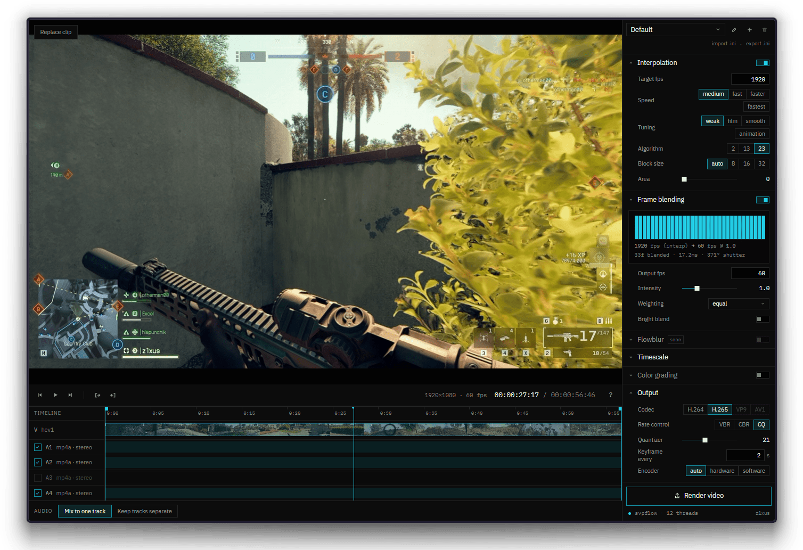

# open-svpflow

open-svpflow is a drop-in open-source replacement for SVPFlow's VapourSynth plugins in Rust.

I made it as a side project, mostly to see if I could get couler's [smoothie-rs](https://github.com/couleur-tweak-tips/smoothie-rs) running in a browser. The [demo](https://smoothie.z1x.us) is the result:

[](https://smoothie.z1x.us)

This proof of concept runs open-svpflow's analysis pipeline as WASM and renders with WebGPU, using [WebCodecs](https://developer.mozilla.org/en-US/docs/Web/API/WebCodecs_API) for video decoding and encoding.

## What's implemented

- `svpflow1`: `Super` and `Analyse`, including super-frame pyramids, multi-level predictors, SAD/SATD and chroma costs, and hex2, UMH, and exhaustive motion search.
- `svpflow2`: `SmoothFps` rendering for algorithms 1, 2, 11, 13, 21, 22, and 23, with scene handling, masks, CPU rendering, and the GPU path.

Output is close, but not byte-exact (yet)

Benchmarked on a 7,992 frame video with [smoothie's](https://github.com/couleur-tweak-tips/smoothie-rs) `faster` preset:

| Path | Original | open-svpflow | Speed vs original | SSIM parity | PSNR |
| --- | ---: | ---: | ---: | ---: | ---: |
| CPU | 60.44 fps | 58.94 fps | 0.975x (2.5% slower) | 98.75% | 45.24 dB |
| GPU | 78.73 fps | 74.82 fps | 0.950x (5.0% slower) | 98.77% | 43.57 dB |

## Build

Rust 1.88 or newer:

```powershell
cargo build --release -p svpflow1 -p svpflow2
```

The plugins are written to `target/release/svpflow1_vs.dll` and `target/release/svpflow2_vs.dll`.

Licensed under Apache-2.0.
