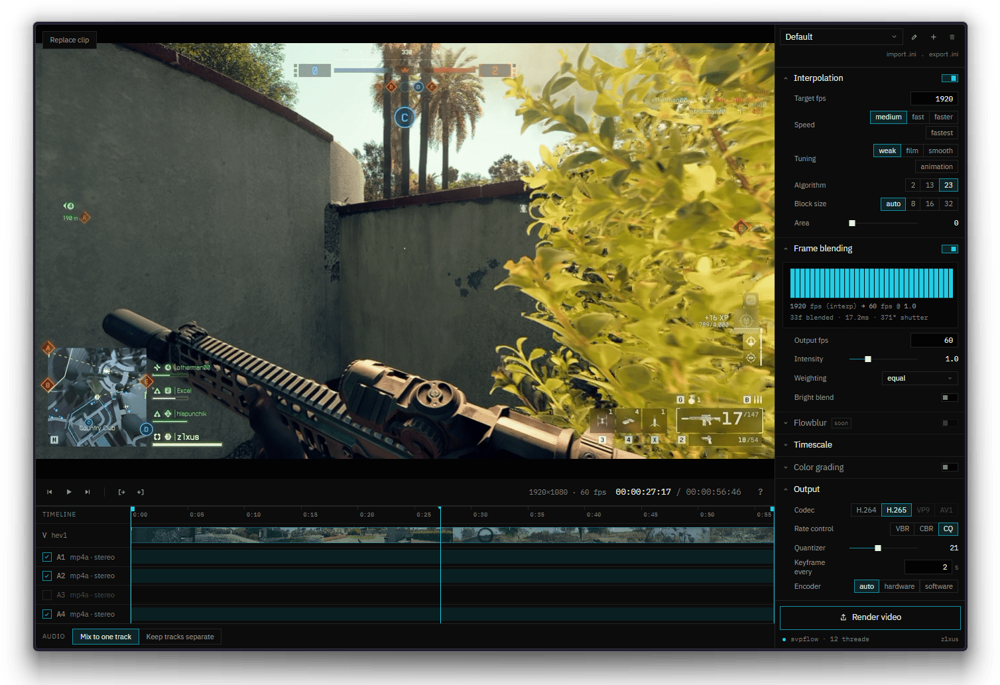

# open-svpflow

open-svpflow is a drop-in open-source replacement for SVPFlow's VapourSynth plugins in Rust. It produces the same frames as SVPFlow (matched to version 4.3.0.168) and runs faster on both CPU and GPU.

It started as a side project, mostly to see if I could get couler's [smoothie-rs](https://github.com/couleur-tweak-tips/smoothie-rs) running in a browser. The [demo](https://smoothie.z1x.us) is the result:

[](https://smoothie.z1x.us)

This proof of concept runs open-svpflow's analysis pipeline as WASM and renders with WebGPU, using [WebCodecs](https://developer.mozilla.org/en-US/docs/Web/API/WebCodecs_API) for video decoding and encoding.

## What's implemented

- `svpflow1`: `Super` and `Analyse`, including super-frame pyramids, multi-level predictors, SAD/SATD and chroma costs, and hex2, UMH, and exhaustive motion search.
- `svpflow2`: `SmoothFps` rendering for algorithms 1, 2, 11, 13, 21, 22, and 23, with scene handling, masks, CPU rendering, and the GPU path.
- Native I444 input and output, which the original SVPFlow doesn't support.
- VapourSynth API 4 support, so it works on current VapourSynth (R80 and newer can't load the original at all, since it only has API 3).
- Part of the motion search runs on the GPU too when GPU rendering is on, which takes a lot of load off the CPU.

Output matches the original byte for byte in everything I've tested, on both CPU and GPU. But GPU algorithms 1 and 2 are the exception, since the original reads uninitialized memory there and doesn't even match its own previous run (±1 on about 0.01% of pixels, same as ours). So it should work anywhere SVPFlow already does, whether that's smoothie, SVP itself, mpv or your own scripts.

Benchmarked on a 1080p 200 fps Counter-Strike 2 clip interpolated to 1920 fps through [smoothie's](https://github.com/couleur-tweak-tips/smoothie-rs) VapourSynth script (Ryzen 5 7600X, RTX 4060, Linux):

| Preset | Path | Original | open-svpflow | Speed vs original | Output |
| --- | --- | ---: | ---: | ---: | --- |
| `faster` | CPU | 307.1 fps | 563.0 fps | 1.83x | identical |
| `faster` | GPU | 1180.1 fps | 1472.0 fps | 1.25x | identical |
| `medium` (default) | CPU | 224.8 fps | 401.1 fps | 1.78x | identical |
| `medium` (default) | GPU | 312.7 fps | 432.9 fps | 1.38x | identical |

## Releases

Download builds for Windows, Linux, and macOS from [Releases](https://github.com/Z1xus/open-svpflow/releases).

New releases are reproducible and immutable once published.

To reproduce the binaries, check out the release commit in a clean directory and use the matching build environment from the [release workflow](.github/workflows/nightly-release.yml). Run `bash .github/build.sh <target>` with the target from the release's `BUILD.txt`, then compare the files in `dist/` with the extracted release.

## Build

Rust 1.88 or newer:

```powershell
cargo build --release -p svpflow1 -p svpflow2
```

The plugins are written to `target/release/svpflow1_vs.dll` and `target/release/svpflow2_vs.dll`.

Licensed under Apache-2.0.
